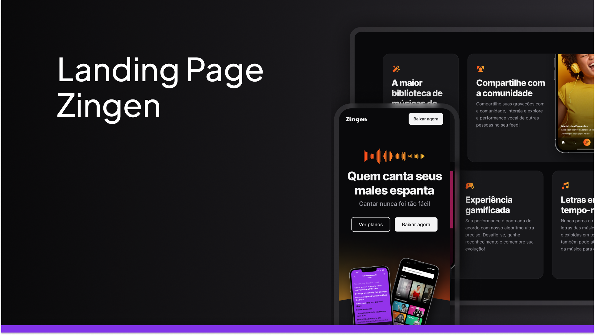

# Projeto Zingen

 **Zingen**.

---

## 📌 Visite o projeto

👉 [Clique aqui para acessar](https://lorenzopvoid.github.io/projeto-zingen/)

---

## 🚀 Tecnologias utilizadas

- ✅ HTML5
- ✅ CSS3 (com animações e responsividade)

---

## 🎯 Funcionalidades

- Design responsivo e moderno
- Animações suaves ao rolar a página
- Seções organizadas (sobre, benefícios, contato)
- Estrutura ideal para apresentação de produtos ou serviços

---

## 💡 Inspiração

- Este projeto foi criado com foco em aprimorar habilidades em front-end, design de interfaces modernas e boas práticas de organização de código.